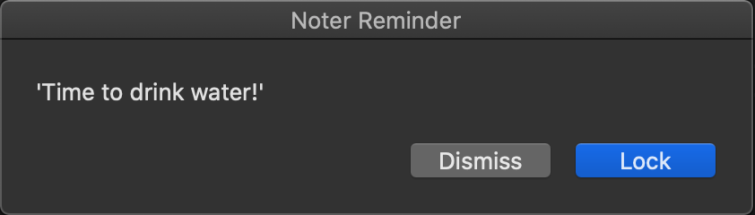

## Noter

A small notification system for macOS



### Usage

```
USAGE:
    noter <SUBCOMMAND>

FLAGS:
    -h, --help       Prints help information
    -V, --version    Prints version information

SUBCOMMANDS:
    add      Adds the specific note to the list
    check    Checks which notes are due
    help     Prints this message or the help of the given subcommand(s)
```

### noter add

```
USAGE:
    noter add [OPTIONS] <NOTE> --time <time>

FLAGS:
    -h, --help       Prints help information
    -V, --version    Prints version information

OPTIONS:
    -d, --datetime <datetime>    Set date in the format yy-MM-dd hh:mm
    -t, --time <time>            Set time in the format HH:MM (default to today)

ARGS:
    <NOTE>
```

#### TODO

- Figure out how to infer the path of the running program to generate the plist file correctly
- Add tests
